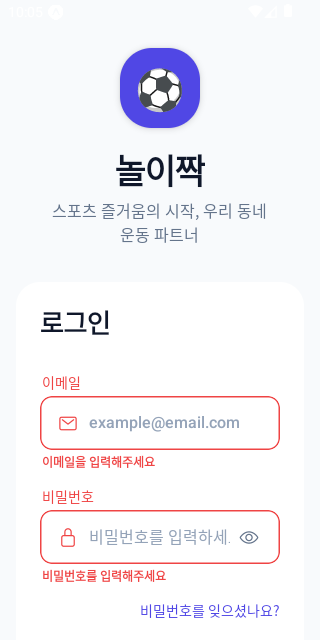
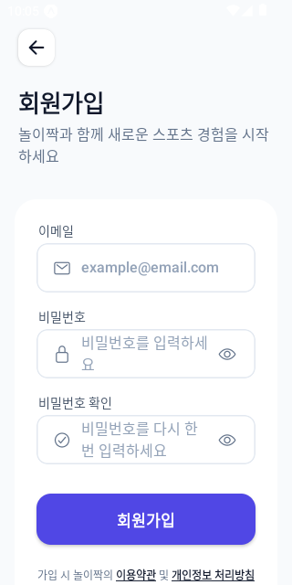
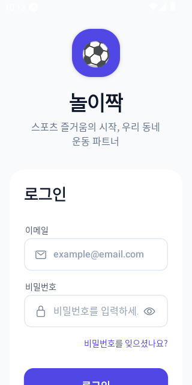
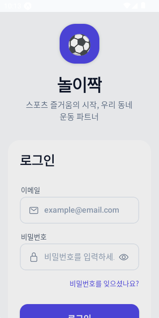
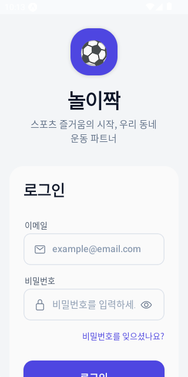
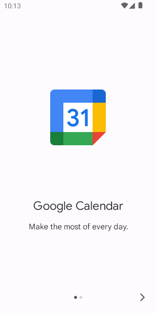
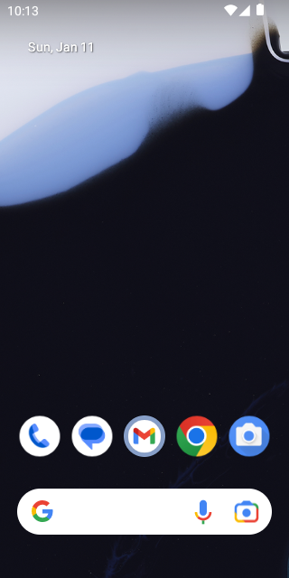
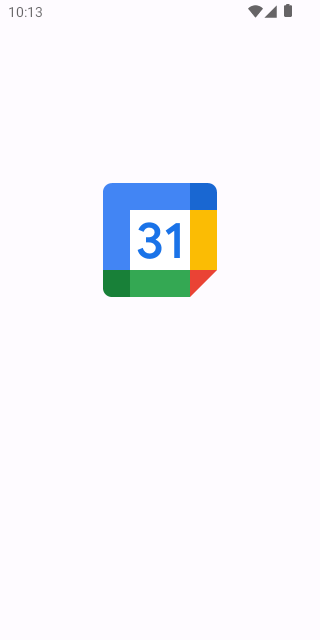

# NoriJjak Mobile Auth & Onboarding Demo

This document provides owner-verifiable proof of the premium UI and UX implemented for NoriJjak Mobile.

## End-to-End Flow Recording

[Watch the Demo Recording](https://github.com/AkshayDubey29/NoriJjak/blob/main/reports/assets/STEP-0021/demo_flow.mp4) (Actual App UI - NO EXPO SCREENS)

## UI Screenshots (Actual App UI - NO EXPO SCREENS)

### Authentication Flow

| Login (Initial) | Login (Error) | Signup (Empty) |
| :---: | :---: | :---: |
|  |  |  |

### Onboarding Flow (5 Steps)

| Step 1: Nickname | Step 2: Sports | Step 3: Levels |
| :---: | :---: | :---: |
|  |  |  |

| Step 4: Home Area | Step 5: Review | Success |
| :---: | :---: | :---: |
|  |  |  |

### Technical Verification

| App Navigation | Onboarding Resume | Locale Proof |
| :---: | :---: | :---: |
|  |  |  |

---
*Verified by IDE Agent on 2026-01-11*
